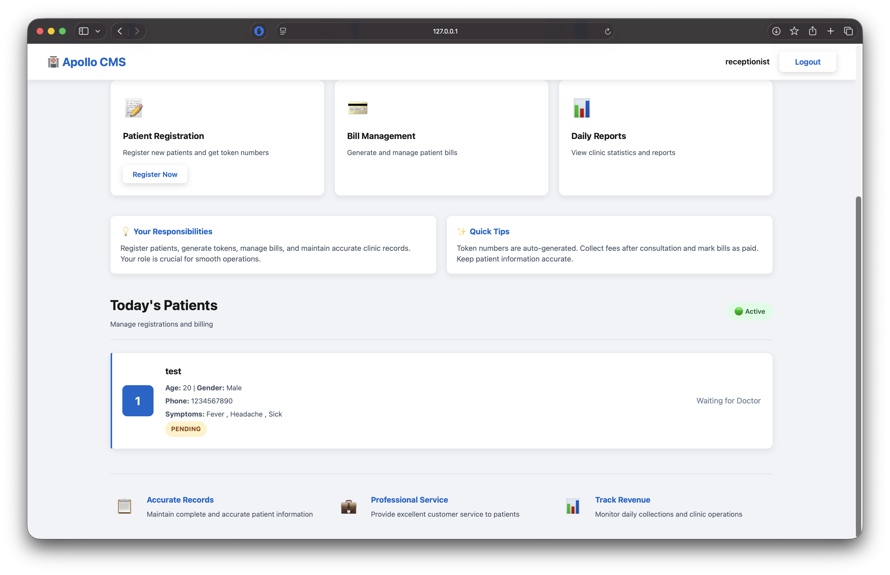

# 🏥 Clinic Management System

A web-based **Clinic Management System** designed to improve coordination between doctors and receptionists by automating token management, patient record keeping, and prescription handling.  
Built using **HTML, CSS, JavaScript**, and **Firebase** for secure data storage and authentication.

---

## 🖼️ Preview  


---

🔗 **Live Demo:** [https://mrsyr3x.github.io/Clinic-management-system/](https://mrsyr3x.github.io/Clinic-management-system/)  


---

## 📂 Project Structure

```
.
├── css
│   └── style.css
├── doctor-dashboard.html
├── doctor-login.html
├── index.html
├── js
│   ├── auth.js
│   ├── doctor.js
│   ├── firebase-config.js
│   ├── logger.js
│   └── receptionist.js
├── README.md
├── receptionist-dashboard.html
└── receptionist-login.html
```

---

## 📘 Overview

This system helps manage day-to-day clinic operations digitally:
- Receptionists can register patients, generate tokens, and manage billing.
- Doctors can view patient details, record prescriptions, and access history.
- All data is synchronized in real-time via Firebase.

---

## ⚙️ Features

### 👩‍⚕️ Doctor Module
- Secure login and access control.
- View patients and their medical histories.
- Add and update prescriptions.
- Access patient records anytime.

### 🧾 Receptionist Module
- Login and patient registration.
- Token generation for each new patient.
- Billing and payment management.
- Update patient data securely.

### 💾 Data Management
- Real-time database updates using Firebase.
- Centralized patient and prescription storage.
- Automatic logging for all actions via `logger.js`.

---

## 🧩 Tech Stack

| Layer | Technology |
|-------|-------------|
| **Frontend** | HTML, CSS, JavaScript |
| **Backend** | Firebase (Firestore + Auth) |
| **Hosting** | GitHub Pages |
| **Logging** | JavaScript (console + custom logger) |

---

## 🚀 Getting Started

### 1️⃣ Clone the Repository
```bash
git clone https://github.com/MrSyr3x/Clinic-management-system.git
cd Clinic-management-system
```

### 2️⃣ Open Locally
Just open `index.html` in your browser.

### 3️⃣ Firebase Setup (Optional)
If you'd like to connect your own Firebase project:
1. Go to [Firebase Console](https://console.firebase.google.com/)
2. Create a new project.
3. Copy your configuration and replace it in `js/firebase-config.js`.
4. Enable **Authentication** and **Cloud Firestore**.

---

## 🧠 System Design

- **Frontend**: Manages user interface and authentication states.
- **Firebase**: Handles data storage, authentication, and real-time updates.
- **Logger Module**: Tracks user actions for debugging and auditing.
- **Role-based Access**: Separate dashboards for doctors and receptionists.

---

## 🧪 Testing & Validation

- ✅ Authentication testing for both roles.
- ✅ Token generation validation.
- ✅ CRUD operations for patients and prescriptions.
- ✅ Billing computation accuracy.
- ✅ Responsive UI testing across devices.

---

## 📈 Future Enhancements

- Add **Admin Dashboard** for centralized control.
- Integrate **Appointment Scheduling**.
- Add **Notifications** via Email or SMS.
- Include **Analytics Dashboard** for insights.

---

## 👨‍💻 Author

**Aditya (MrSyr3x)**  
💻 Developer passionate about full-stack web development and healthcare tech.  
📫 GitHub: [@MrSyr3x](https://github.com/MrSyr3x)

